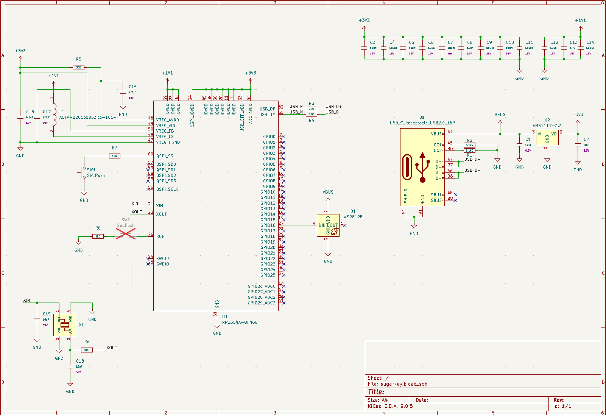
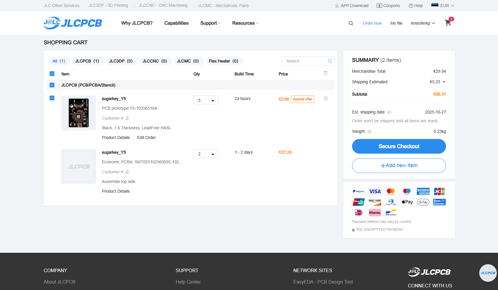

# sugarkey

A FIDO2 compliant security key powered by my sugar addiction (and RP2354).
Firmware is [Pico Keys](https://github.com/polhenarejos/pico-fido) by Pol Henarejos.

Done in collaboration with [Blueprint by Hack Club](https://blueprint.hackclub.com/r/1569?ref=r).

## Features
* Powered by RP2354 with 2 MB of on-chip flash and built in security features.
* Open Source
* Compact (around 3cm x 2cm)
* Protective case

## Getting started
* Have your sugarkey with you (JLCPCB fabrication files are in the production folder)
* Plug in your sugarkey while holding down BOOTSEL button.
* Download the latest [Pico Keys](https://www.picokeys.com/getting-started/) firmware for the Raspberry Pi Pico 2.
* Copy the downloaded .uf2 file to the Picoboot storage mount.
* Commisson your sugarkey [here](https://www.picokeys.com/pico-commissioner/).
* The LED is a WS2812 on GPIO 16.
* Plug the key into your device, it will show up as a passkey.

## Hardware
* MCU: RP2354A
* LED: WS2812 or similar
* Raspberry Pi recommended LDO, inductor, crystal oscillator.

## **Disclaimer!**
This isn't a finished product and shouldn't be trusted with super important stuff.
I am in no way responsible for lost data.

## Schematic

## PCB

## Picture of the JLCPCB cart
